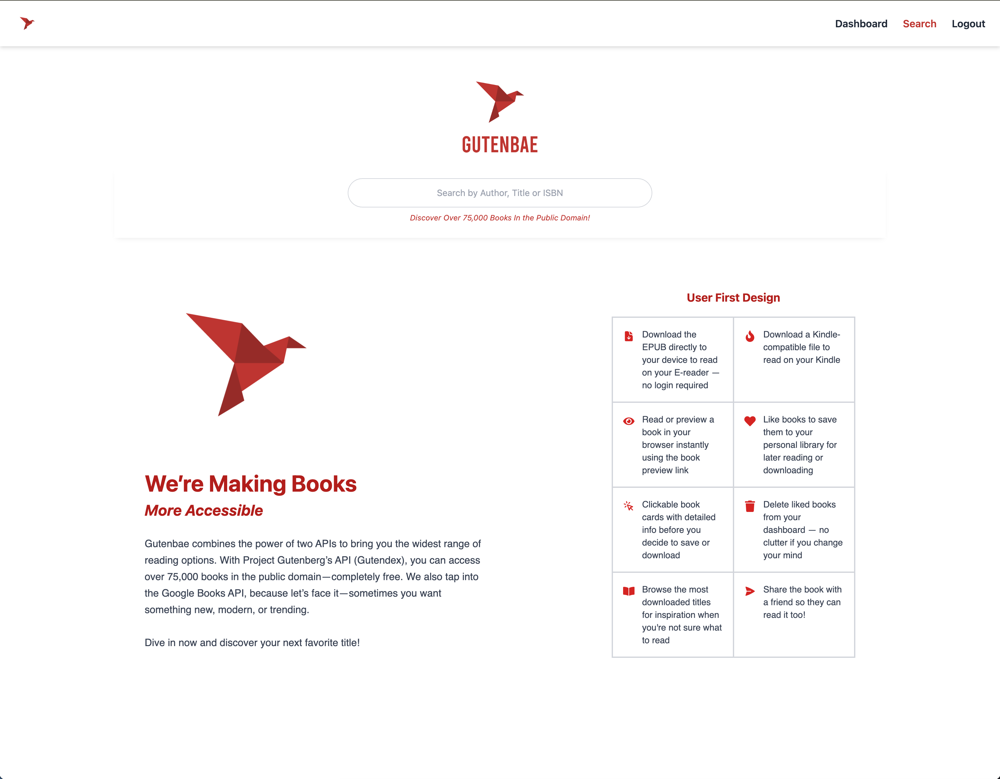
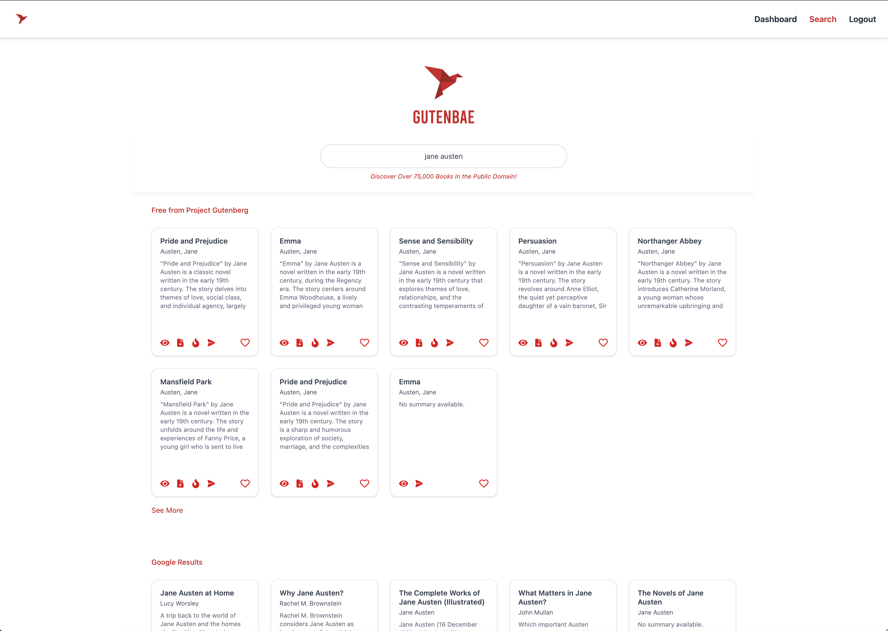
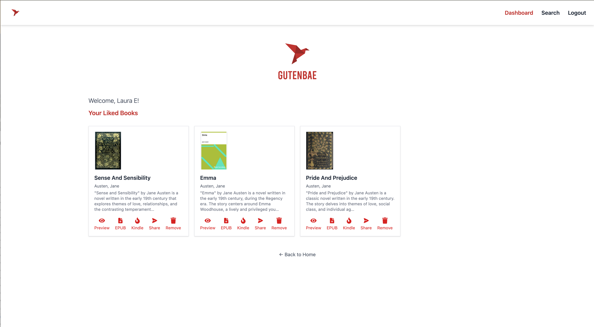

# GutenBae2
GutenBae is a modern book discovery app that allows users to search for and save books using the Gutendex API. It focuses on public-domain texts and makes discovering, previewing, and downloading classic literature simple and user-friendly.

## Live Site
https://gutenbae2.onrender.com

## Screenshots
### Landing + Search Page

### Search Results 

### User Dashboard (Liked Books)

## Features
- Public Search & Explore – Search by title, author, keyword, or genre using integrated APIs.

- Book Downloads – Instantly download EPUB, Kindle, or HTML versions of public domain books.

- Preview & Share – Read online and share public links with others.

- Login & Authentication – Securely create an account and log in using JWT-based authentication.

- Personal Library – Save favorite books to your dashboard for later reading or downloading.

## Wishlist – Keep track of books you'd like to read in the future.

- Responsive UI – Optimized for mobile, tablet, and desktop devices.

## In Progress / Coming Soon
- Featured/Explore page for easier discovery based on interests

- Rate and review titles on public detail page

- Dynamic metadata for better SEO and shared previews

- Upload custom book covers

- Categorize saved books with user-created tags or shelves

- Password recovery and account deletion

- Additional free book resources beyond Gutendex

- FAQ and help guide for downloading to mobile or Kindle

## Running the App Locally
1. Clone the repository

git clone https://github.com/LauraEllingson/GutenBae2.git

2. cd GutenBae2

### Set up the server

3. cd server
4. npm install
5. Create a .env file in the server/ directory with the following:

- MONGO_URI=your_mongodb_connection_string
- JWT_SECRET=your_jwt_secret

### Start the server:

6. npm run start

### Set up the client

In a new terminal tab or window:

7. cd client
8. npm install
9. npm run dev
10. The app will be available at http://localhost:5173

## Contributing
Contributions are welcome. To contribute:

1. Fork the repository

2. Create a new branch (git checkout -b feature-name)

3. Commit your changes (git commit -m "Add feature")

4. Push to the branch (git push origin feature-name)

5. Open a pull request

